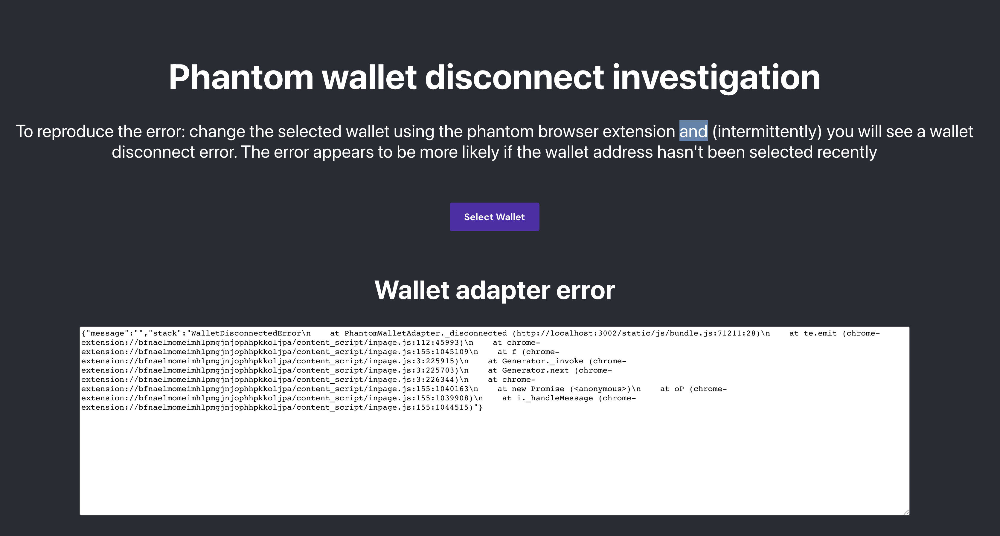

# Solana Wallet Adapter test

This project was bootstrapped with [Create React App](https://github.com/facebook/create-react-app).

It is the simplest possible wallet connection dApp that allows testing switching between solana wallet adapter wallets, intended to reproduce a bug where selecting a different wallet in the Phantom extension will cause the wallet adapter to disconnect and an error to be thrown. When an error is thrown it will be displayed in a text box like below:

## Available Scripts

In the project directory, you can run:

### `yarn start`

Runs the app in the development mode.\
Open [http://localhost:3000](http://localhost:3000) to view it in the browser.

The page will reload if you make edits.\
You will also see any lint errors in the console.
